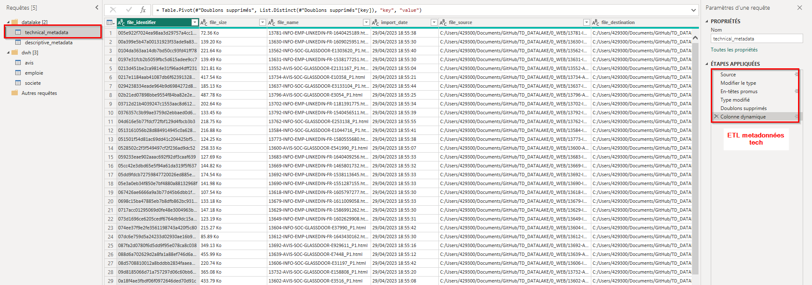

# Projet web scapping, datalake et datavisualisation

>Malo PARIS - M2 BI&A G2 - 2023

## Préambule
Dans le candre de notre Master 2, je dois implémenter un datalake en python afin d'en assimiler les concepts principaux et de réaliser une application de visualisation d'offres d'emploie.

>Rappel definition datalake :
Un datalake est un magasin de données qui combine le stockage des données non **structurées et structurées**. Il sert principalement à la récupération et à l'analyse des données non structurées, telles que les images, les documents, les flux vidéo et audio et les données de log. Les données structurées sont également stockées dans un datalake et peuvent être consultées et **analysées pour prendre des décisions**. Le datalake est un moyen pratique et abordable de collecter, stocker, gérer et analyser des données volumineuses.

Pour l'aspect code, je vais donc utiliser Python ainsi que des librairies de webscapping. Pour la transformation et visualisation des donnée, PowerBI.

Le projet se découpe en **4 phases** décrites dans le visuel cu-dessous, cependant voici des détails complémentaires.


## Explication des phases du projet

***

### Phase 1 : récupération des données depuis le WEB

L'objectif ici est de simuler le web car il est chronophage d'extraire toutes ces manuellement et ce n'est pas le but de l'exercice. 
Nous avons donc déjà un extrait de ces pages qui sont stockés dans le dossier `0_WEB` : ce sera notre source.

Je dois alors créer un code python permettant de : 
- Ingérer les pages dans `0_WEB` et les **copier** dans dans mon datalake, en `01_LANDING_ZONE`. C'est une simple copie des données brutes, compartimentée par type de donnée source (Avis entreprise, Offre emploie et Société)

- Au moment de l'ingestion, le code doit "prendre une photo" des métadonnées techniques de chaque page web et les stocker sous forme de table clef - valeur, enregistré au format `.csv`.

Exemple : 
| File_identifier   | Key | Value |
| ------ | --- | --- |
| Hash1 | file_name  | web_**1** |
| Hash1 | file_dest  | landing_zone/Avis/web_**1**.html |
| Hash2 | file_name  | web_**2** |
| Hash2 | file_dest  | landing_zone/Avis/web_**2**.html |

Voir le fichier complet [ici](1_DATALAKE/01_LANDING_ZONE/technical_metadata.csv)

> Remarque: pour créer un identifiant unique pour chaque page web (File_identifier), j'ai utilisé une fonction de hashage md5 pour transformer son nom en un code (exemple : 10e18963ecf667055e93e6f745f7bb41)


***

### Phase 2 : la récupération des métadonnées descriptives

Maintenant que les pages web brutes sont stockées dans notre Datalake et leurs métadonnées techniques d'extraction crées, nous pouvons commencer l'extraction des informations descriptives : c'est au sein des balises HTML que réside toute la valeur encore inexploitée.

Pour passer de ces pages web brutes à des données utilisables par un outil de datavisualisation, nous devons 'webscapper' ces pages, c-à-d récupérer de manière automatique chaque champ interessant à l'aide d'expressions régulière, entre autre.

Heureusement, je n'ai pas eu besoin de créer ces fonction et j'ai pu les appliques telles quelles.

Le code ici doit donc :
- Aller relire le fichier de métadonnées technique précédent et récupérer le champ contenant la destination de chaque page web lors de son import.
- En partant de ce chemin, je dois ensuite aller ouvrir chaque page web et 'scrapper' les informations interessantes.
- Enfin, après un peu de nettoyage, je doit stocker ces information sous forme de clef-valeur dans un fichier de métadonnées descriptives.

Voir le fichier de metadonnées descr. complet [ici](1_DATALAKE/02_CURATED_ZONE/descriptive_metadata.csv)

>Pourquoi tout stocker en clef-valeur ?
Cette méthode permet une flexibilité impossible avec un stockage colonne : nous ne sommmes par contraint par un schémas de table. Si un jour nous souhaitons extraire de nouvelle données de ces pages, cela ne remet pas en cause notre modèle.


***

### Phase 3 : Transformation des metadonnées en table exploitable

Nous avons récupéré nos métadonnées techniques et descriptives. Avant de pouvoir les visualiser, nous devons les transformer. Pour cela il nous faut les extraire, transformer et charger dans l'outil de notre choix.

Ceci n'étant pas le coeur de ce projet, j'ai doit décidé d'utiliser PowerQuery, le requeteur intgégré de PowerBi pour effectuer ces étapes.

Voici ce qui est réalisé : 
- Pour les métadonnées technique :
    - Connexion au fichier .csv 
    - Pivot sur la colonne key permettant de pivoter toutes les valeurs de key de lignes en colonne
- Pour les métadonnées descriptives :
    - Connexion au fichier .csv  
    - Supression des doublons si nécéssaire
    - Pivot de la table sur la colonne key permettant ramener tout les valeurs de key en colonne
    - Liaison avec métadonnées technique grâce au file_identifier pour récupération de colonnes de : 
      - La LANDING_ZONE de provenance du datalake (EMP, AVIS ou SOC)
      - La date d'extraction du fichier
- Création des 3 tables décisionnelles (emploie, avis et societe)

***

### Phase 4 : Datavisualisation

Nos 3 tables décisionnelles sont crées : il me reste plus qu'a créer un tableau de bord utile à la recherche d'emploie.

Il sera divisé en 3 écrans : 
- Une 'Home page' pour avoir une vue globale sur les offres et les entreprises
- Une page 'Liste des offres' permettant de parcourir et filtrer les offres
- Une page 'Détail entreprise' pour rechercher et voir les informations d'une entreprise

Voir les captures d'écrans en fin de page.

Ouvrir le fichier .pbix [ici](3_DATAVIZ/Job_dashboard.pbix) avec PowerBi Desktop

# Explication technique

## Structure du projet

Le projet est sensé représenter la structure interne d'un Datalake et contenir le code pour l'alimenter. C'est pourquoi nous avons plusieurs dossiers : 


- `0_WEB` : Ce dossier simule le web avec les pages, c'est la source.
- `1_DATALAKE` : C'est notre datalake composé de : 
  - `01_LANDING_ZONE` : l'endroit ou sont stockés les pages web une fois extraites. Elle sont rangés dans 3 sous dossier en fonctione de leur provenance `AVIS`,`SOC`,`EMP`. C'est aussi l'endroit ou est stocké le fichier de `technical_metadata.csv`
  - `02_CURATED_ZONE` : l'endroit ou sont stockées les `descriptive_metadata.csv`
- `3_DATAVIZ` : l'endroit ou est stocké la dataviz
- `DVLP` : Cest le dossier contenant tout le code et modules nécéssaire
  - `app_settings.yaml` : c'est un fichier pour configurer simplement la base de son projet pour le code
  - `functions_b4soup.py` : contient toutes les fonction de webscapping
  - `functions.py` : contient toutes les fonctions de base
  - `main.py` : c'est le code principale, le fichier qu'il faut exécuter
- `Z_DOC` : la doc et photos

à la racine : 
- `readme.md` : ce document
- `requirements.txt` : les librairies python à installer

## Installation

- Clonez ce projet
  
```sh
git clone https://github.com/malow106/Python-datalake
```

- Allez dans le dossier cloné :
  
```sh
cd TD_DATALAKE
```

- Modifié la ligne suivante dans le fichier de config pour y insérer le chemin complet menant à votre projet : 
  
``` yaml
proj_path: <__>
# exemple : 
# proj_path: C:\Users\userid\Documents\Python-datalake\
```

- Créez un envisonnement virtuel python isolé sur votre machine  : 
  
``` sh
python -m venv venv
```

- activez le  : 
  
``` sh
venv\Scripts\activate
```

- installez les librairies  : 
  
``` sh
pip install -r requirements.txt
```

## Utilisation

Lancez le programme avec la commande suivante : 

```sh 
python DVLP/main.py
```

Vous verrez alors les étapes d'ingestion et de récupération des métadonnées : 

```sh 
Ingestion des pages web *AVIS-SOC* ...: 100%|█████████████████████████████████████████████████████████████████████████████████████████████████████████████| 209/209 [00:23<00:00,  8.98it/s]
Ingestion des pages web *EMP* ...: 100%|██████████████████████████████████████████████████████████████████████████████████████████████████████████████████| 254/254 [00:12<00:00, 20.43it/s]
Ingestion des pages web *INFO-SOC* ...: 100%|█████████████████████████████████████████████████████████████████████████████████████████████████████████████| 140/140 [00:20<00:00,  6.80it/s]
Recupération métadonnées descriptives ...: 100%|██████████████████████████████████████████████████████████████████████████████████████████████████████████| 603/603 [02:40<00:00,  3.77it/s]
```

Le code est structuré pour être logique et facilement lisible.
Dans le fichier `main.py` et `functions.py` vous retrouverez les phases décrites ci-dessus ainsi que les différentes fonctions.
Dans le fichier `functions_b4soup.py` sont centralisées toutes les fonctions de webscrapping et de nettoyage de la donnée.

Les fichiers `technical_metadata.csv` et `descriptive_metadata.csv` sont alors générés ou agrémentés si il déja existants.


## Captures d'écran de l'ETL


Modèle de donnée pour dataviz


Flux de transformation


Transformation .csv metadonnées techniques


Transformation .csv metadonnées descriptives


## Captures d'écran du résultat de la dataviz

La Home page :


Zoom sur le parametrage du graphique de gauche et la fonction de visualisation des offres au survol


Zoom sur le graphique de comparaison des sociétés


Au clic sur le bouton 'Voir les offres' affichage de la page de détail :


Au clic sur le bouton 'Voir les entreprises' affichage de la page de détail :
